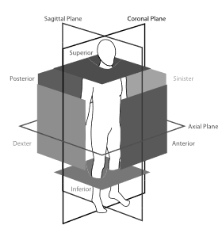

# PyTorch implementation of the Bounding Box Network (BoBNet) from the ```ConvNet-Based Localization of Anatomical Structures in 3D Medical Images``` paper.

The following figure presents the bounding box walls (opaque squares) and viewing planes (outlined rectangles) shown with anatomical location terminology that is used in the annotation protocol. Image taken from (De Vos et al., 2017).



# Installation
> pip install -r requirements.txt

# Usage

**Note:** Supported file formats are NIfTI and .mha.

For training we use json files to define the training and validation files. You can find a simple tool under ```tools/create_json_sets.py``` which allows you to create json files for n folds for your dataset.

## Training

### Important! The --resample_input_images and --resize_input_images arguments can/should be used to resample the input images. First through-plane to 3.0 mm slich thickness and 1.5 mm spacing. Second in-plane to (spacing[0] / voxel_size, spacing[1] / voxel_size) pixels. If the input images are already thickslice images / resampled you can skip toggling the --resample_input_images to speed up training. For Coronary Artery Calcium (CAC) scoring it's necessary to toggle those flags on your training command.

### Simple training command
```bash
python scripts/train.py \
--train_images_json path_to_input_train_images \
--val_images_json path_to_input_val_images \
--labels_dir path_to_input_labels_dir \
--scan_info path_to_scans_slice_thicknesses
--output_dir path_to_output_dir \
--out_classes number_of_output_classes_default_1_for_binary_classification \
--resample_input_images --resize_input_images
```

### Detailed training command
```bash
python scripts/train.py \
--train_images_json path_to_input_train_images \
--val_images_json path_to_input_val_images \
--labels_dir path_to_input_labels_dir \
--scan_info path_to_scans_slice_thicknesses
--output_dir path_to_output_dir \
--out_classes number_of_output_classes_default_1_for_binary_classification \
--resample_input_images toggle_to_resample_input_images_through_plane
--resize_input_images toggle_to_resize_input_images_in_plane
# Optional arguments (can also passed to docker image)
--checkpoint path_to_checkpoint
--epochs number_of_epochs_default_30
--sample_rate sample_rate_default_1.0
--batch_size int_batch_size_default_64
--lr learning_rate_default_1e-3
--lr_decay_rate learning_rate_decay_rate_default_0.1
--momentum momentum_default_0.9
--nesterov use_nesterov_momentum_default_true
--weight_decay weight_decay_0.0005
--center_crop toggle_center_crop_during_validation_default_false
--balance_classes toggle_to_balance_training_classes
--device device_name_device_to_use_default_cuda
```

## Testing
For testing we use the predictor script which includes all necessary components to run bobnet without importing from src. This is done for ease for use when bobnet is used only for inference (you just need one file) and for building a docker image.

```bash
python scripts/predictor.py path_to_input_images path_to_output_dir
# Optional arguments (can also passed to docker image)
--checkpoint path_to_trained_model_checkpoint
--scan_info path_to_scans_slice_thicknesses
--scan_slice_thickness fixed_float_slice_thickness_instead_of_scan_info
--postprocessing toggle_to_enable_transform_thickslice_predicted_bounding_boxes_to_original_image
--voxel_size fixed_float_voxel_size_default_to_trained_model_voxel_size
--batch_size int_batch_size_default_64
--device device_name_device_to_use_default_cuda
```

# Docker
Build the image:
```bash
DOCKER_BUILDKIT=1 docker build -f Dockerfile -t bobnet_predictor:latest .
```
#
### Optional
Save the image:
```bash
docker save -o bobnet_predictor.tar bobnet_predictor:latest
```
Load the image:
```bash
docker load -i bobnet_predictor.tar
```
Run the image:
```bash
docker run -d --name bobnet_predictor bobnet_predictor:latest
```
###
#
Run the container using GPU:
```bash
docker run --gpus all -it -v ./input_dir:/input -v ./out_dir:/output bobnet_predictor:latest /input /output
```
Run the container using CPU:
```bash
docker run -it -v ./input_dir:/input -v ./out_dir:/output bobnet_predictor:latest /input /output --device cpu
```

## License

**BoBNet** is under [](https://opensource.org/licenses/Apache-2.0)

# Citation

```BibTeX
@ARTICLE{7862905,
    author={de Vos, Bob D. and Wolterink, Jelmer M. and de Jong, Pim A. and Leiner, Tim and Viergever, Max A. and Išgum, Ivana},
    journal={IEEE Transactions on Medical Imaging},
    title={ConvNet-Based Localization of Anatomical Structures in 3-D Medical Images},
    year={2017},
    volume={36},
    number={7},
    pages={1470-1481},
    keywords={Computed tomography;Three-dimensional displays;Anatomical structure;Two dimensional displays;Abdomen;Heart;Localization;detection;convolutional neural networks;CT;deep learning},
    doi={10.1109/TMI.2017.2673121}
}
```
